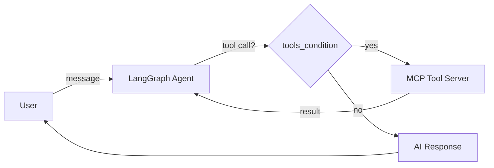

# AI Agent with LangGraph & MCP


> **TL;DR:** An async AI agent built with LangGraph that dynamically discovers and uses external tools via the Model Context Protocol (MCP). The agent reasons about when to call tools and when to respond directly — a pattern central to modern agentic systems.

## What This Does

This project demonstrates a **tool-calling AI agent** where:

1. An **MCP server** exposes tools (e.g., `add`, `multiply`) over stdio
2. A **LangGraph agent** connects to the MCP server, discovers available tools at runtime, and binds them to an LLM (GPT-4o-mini)
3. The agent uses **conditional edges** to decide whether to call a tool or respond directly, looping until the task is complete

The key insight is that the agent doesn't have hardcoded tool knowledge — it discovers tools dynamically through MCP, making it extensible to any tool server.

## Architecture



## How It Works

**MCP Server** (`src/mcp/math_server.py`) — A lightweight FastMCP server exposing math operations:

```python
from mcp.server.fastmcp import FastMCP

mcp = FastMCP("Math")

@mcp.tool()
def add(a: int, b: int) -> int:
    """Add two numbers"""
    return a + b
```

**LangGraph Agent** (`src/langgraph_w_mcp.py`) — Builds a stateful graph with conditional routing:

```python
graph_builder.add_conditional_edges(
    "call_model",
    tools_condition,         # LangGraph decides: tool call or final answer?
    {"tools": "tool", END: END}
)
```

## Sample Interaction

```
You: What is 5 + 3?
AI: 8

You: Multiply 12 and 7
AI: 84
```

## Project Structure

```
├── README.md
├── .gitignore
├── requirements.txt
├── notebooks/
│   └── ai_agent_langgraph.ipynb   # Interactive notebook version
└── src/
    ├── langgraph_w_mcp.py         # Async agent with MCP integration
    └── mcp/
        └── math_server.py         # MCP tool server
```

## Setup

```sh
python -m venv venv
venv\Scripts\activate    # Windows
pip install -r requirements.txt
```

Set your OpenAI API key:
```sh
set OPENAI_API_KEY=your-key-here
```

Run the agent:
```sh
python src/langgraph_w_mcp.py
```
